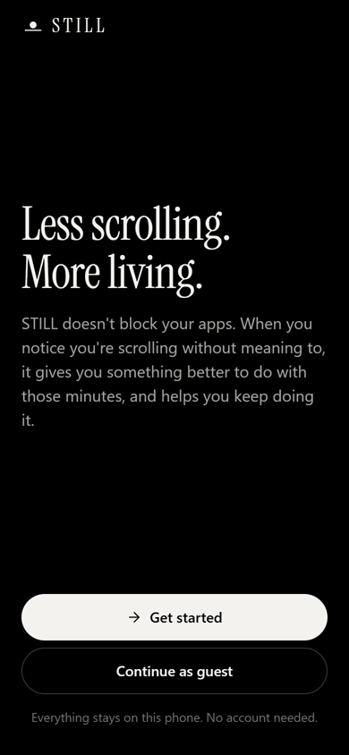
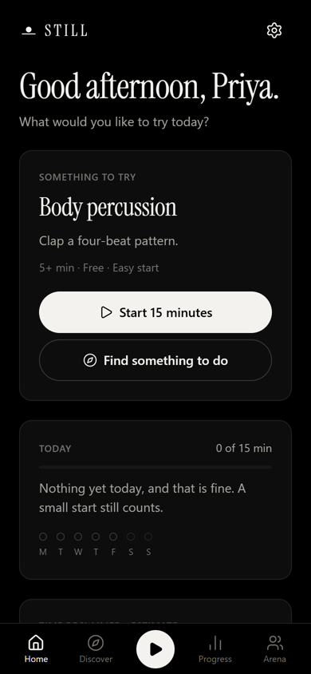
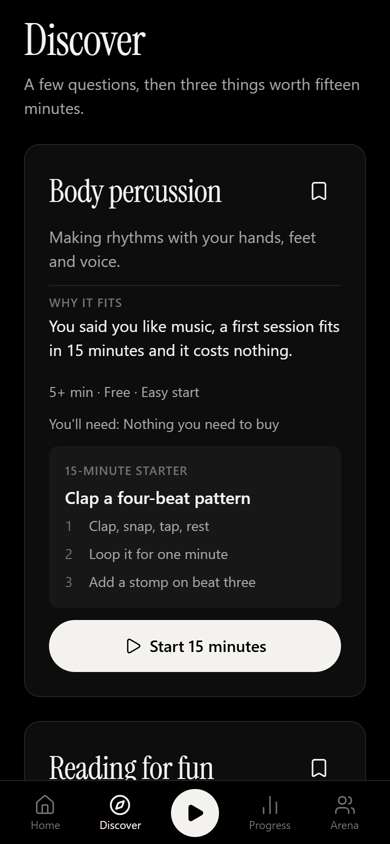
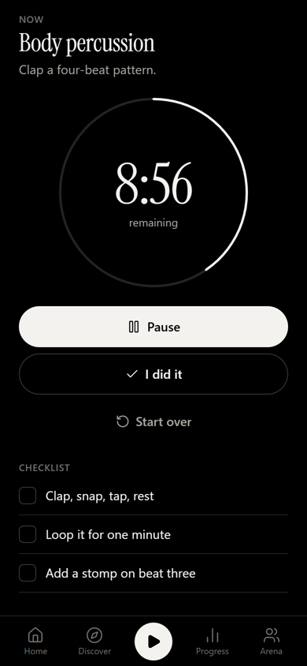
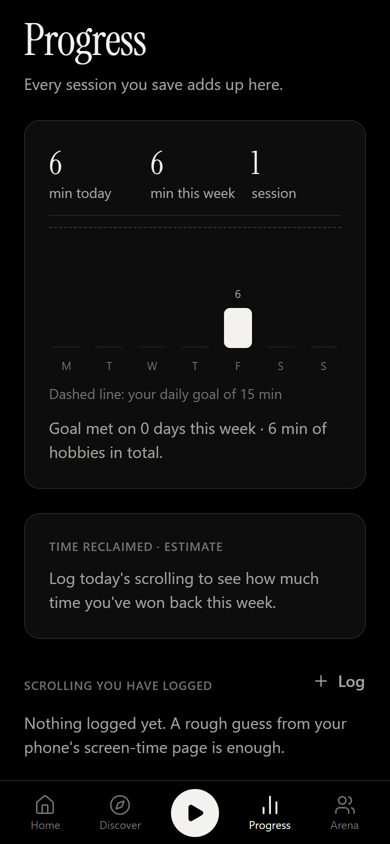
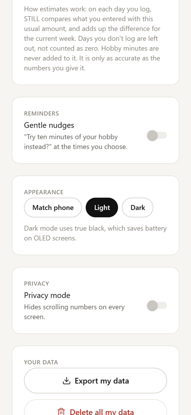

# STILL

**Less scrolling. More living.**

STILL helps students and young adults swap unplanned scrolling for small, real hobbies. It doesn't block apps. When you notice you're scrolling, it gives you something better to do with those minutes, makes starting take fifteen minutes, and keeps track of what you've won back.

<p>
  
  
  
  
  
  
</p>

**Demo video (48 s):** [STILL-demo.mp4](../../releases/download/demo-v1/STILL-demo.mp4)

Built by Team Phantom Troupe for **Ick-a-thon 2026** (IEEE WIE, SSN) on the problem *"Doomscrolling steals youth's free time, with no easy way out."*

## Install on your phone

**Android:** download `STILL.apk` from the [latest release](../../releases/tag/latest), open it, and allow installs from your browser or files app when asked. Every push to `main` rebuilds it.

**iOS:** install **Expo Go** from the App Store, run `npx expo start` on a computer on the same Wi-Fi, and scan the QR code with the Camera app. A standalone iOS build needs an Apple Developer account (`npx eas-cli build -p ios`).

## What it does

| Screen | What you can do |
| --- | --- |
| Welcome and onboarding | Start as a guest or sign in. Optional questions: name, interests, time, budget, solo or social, skill, usual scroll time, reminder times. Every step can be skipped. |
| Home | Greeting, a daily intention, your hobby with **Start 15 minutes**, today's goal, this week at a glance, and estimated time reclaimed. |
| Discover | A short chat-style quiz, then three different hobbies with why they fit, cost, materials, difficulty and a 15-minute starter task. Save, start, show three others, or change answers. |
| Start | A focused timer (5, 10, 15 or 30 min) with start, pause, resume, start over, a checklist and an optional reflection. It survives backgrounding and restarts, and notifies you when time is up. |
| Progress | Today, this week and totals, a week chart against your goal, the reclaimed-time estimate, your scroll logs (add, edit, delete), milestones and recent sessions. |
| Arena | Opt-in sharing and leaderboard, weekly challenges computed from your real sessions, invites. Without an account it shows clearly labelled sample people; with an account you get invite codes, friend requests and a real weekly leaderboard. |
| You (settings) | Name, daily goal, usual scroll time, reminders, light, dark (true black for OLED) or match phone, privacy mode, AI consent, export and delete your data, sign out. |

## How the numbers work

- **Time reclaimed (estimate):** for each day you log this week, STILL compares what you entered with your usual daily scroll time, and adds up the difference. Days you don't log are left out, not counted as zero. Hobby minutes are never added to it. It is labelled as an estimate everywhere.
- **Sessions** are saved only when you tap *I did it*, after at least one minute, with the real elapsed time measured from timestamps. Starting a timer is never counted as a completed hobby.
- **Challenges and leaderboards** are computed from saved sessions. On the server they come from SQL functions, so no one can post their own score, and scroll time is never shared.

## Architecture

```
src/
  app/              Expo Router screens: (tabs) Home, Discover, Start, Progress, Arena; welcome, onboarding, auth, settings, log-scroll
  components/       ui/ primitives (Text, Button, Chip, Field, Card, Meter, FadeIn, PressableScale) and feature components
  theme/            tokens.ts: the only place colours, type, spacing, radii, elevation and motion live
  domain/           pure, tested rules: catalogue, ranking, timer, sessions, progress, challenges, dates
  application/      store (state + actions), coach use case, active timer session, reminders
  data/             snapshot, local persistence, outbox sync and merge (data-provider pattern)
  infrastructure/   Supabase client and provider, secure storage, notifications, social, on-device LLM (local-llm.ts)
supabase/
  migrations/       schema, row-level security, social functions, generated hobby catalogue
scripts/            hobby seed generator, PGlite database tests
```

**Local-first, low latency.** Screens read an in-memory snapshot, so every tap responds immediately and the app works offline and without an account. Changes are written to AsyncStorage with a latest-wins writer. When you're signed in, they also go to Supabase through an ordered outbox that retries when the app returns to the foreground. Signing in merges guest progress into the account.

**AI coach, on the phone.** Ranking and filtering by time, budget, place, company and skill always run on the phone and are deterministic, so suggestions appear instantly. The AI coach then personalises them with an open-source model, **Qwen3.5 2B** (Apache 2.0), or **Qwen3.5 0.8B** for older phones, running through llama.cpp ([llama.rn](https://github.com/mybigday/llama.rn)). It is a one-time download from Hugging Face. After that it is free forever, works offline, needs no account or API key, and your answers never leave the device. Generation is grammar-constrained to a JSON schema whose `hobbyId` can only be one of the compatible candidates, and the result is validated again before it is shown. If anything fails, the on-device suggestions stay.

**Security.** No secrets ship in the app, and there are no paid APIs. The publishable Supabase key is public by design, and every personal table has owner-only row-level security. Auth tokens are stored in SecureStore, chunked to fit its size limit. Model downloads are written to a temporary file first, size-checked, and only then used.

**Design.** Calm and editorial: Instrument Serif for display, the system font for body, fine borders, generous space. All colours are neutral placeholders in `src/theme/tokens.ts`; change them there to rebrand the whole app. Motion follows Emil Kowalski's rules: press feedback at 0.97 scale, entrances fade in with an 8px lift and short stagger, ease-out under 300 ms, no animation on tab switches, and Reduce Motion is honoured.

## Run it locally

```bash
npm install
npx expo start          # scan the QR code with Expo Go (Android or iOS)
```

It runs with no configuration: no account needed, everything on the phone. The AI coach needs the APK (or another native build), because llama.cpp can't run in Expo Go or the browser. Open Discover and tap **Download the AI coach**.

## Accounts and friends (optional)

Accounts, backup and real friends use Supabase (open source, free plan). Without it, the app works fully on one phone and Arena uses labelled sample people.

```bash
npx supabase link --project-ref <your-ref>
npx supabase db push
```

Then set `EXPO_PUBLIC_SUPABASE_URL` and `EXPO_PUBLIC_SUPABASE_KEY` in `.env.local`, and as GitHub Actions secrets for the APK.

## Quality checks

```bash
npm run check           # typecheck, lint, unit tests, database tests
npm run test:db         # runs every migration in PGlite and checks the access rules
npm run test:e2e        # with `npx expo start --web --port 8098` running: full journey in Edge
npm run db:hobbies      # regenerate the hobby seed after editing src/domain/catalog.ts
```

CI runs all of this on every push, every pull request and nightly, plus `expo-doctor`, a production Android bundle with a size budget, and the full browser journey in dark and light mode, with screenshots uploaded as artifacts.

## Known limits

- Scroll time is self-reported. Reading other apps' usage needs platform screen-time APIs (Android UsageStats, iOS Screen Time), which is the next step.
- The APK is signed with the debug key, which is fine for sideloading. Play Store releases need a real keystore or EAS Build.
- Friend features need Supabase configured. Without it, Arena uses labelled sample people.
- The AI coach needs about 1.6 GB of free RAM for the 2B model, or about 0.8 GB for 0.8B. Speed depends on the phone. Suggestions never wait for it.
- Deleting data removes all records. Deleting the login itself needs a server-side admin call, which isn't built yet.
